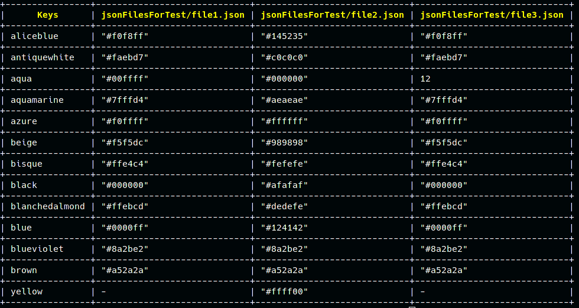
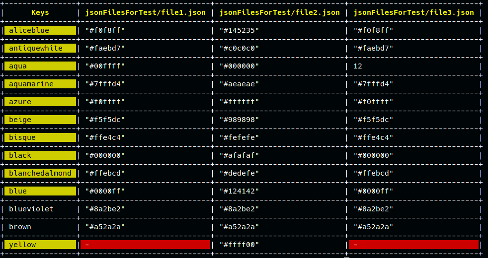
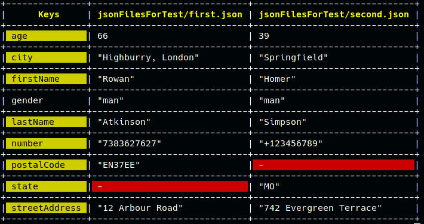

# Parser Json Into Table

This is a simple parser for .json files, which was written in C++.  
--- 
-----
## Usage

1. `git clone https://github.com/danillucky1234/parseJsonIT.git`  
or  
`git clone git@github.com:danillucky1234/parseJsonIT.git`

2. `cd parseJsonIT`

3. `git clone https://github.com/nlohmann/json.git && git clone https://github.com/p-ranav/tabulate.git` 

4. `g++ main.cpp -Wall -std=c++17 -o jsonParser`

5. `./jsonParser jsonFilesForTest/file1.json jsonFilesForTest/file2.json jsonFilesForTest/file3.json`  

    

 or smth like this:  
`./jsonParser jsonFilesForTest/first.json jsonFilesForTest/second.json`

    

Also you can use additional options like `-c`, which can help find different values in the spreadsheet like this:  
`./jsonParser jsonFilesForTest/first.json jsonFilesForTest/second.json -c`  

    

    

## Use `-h` to get detailed information  
This project was originally designed to compare .json files obtained with exiftool, so here is what the table with the files generated with exiftool looks like:

    

